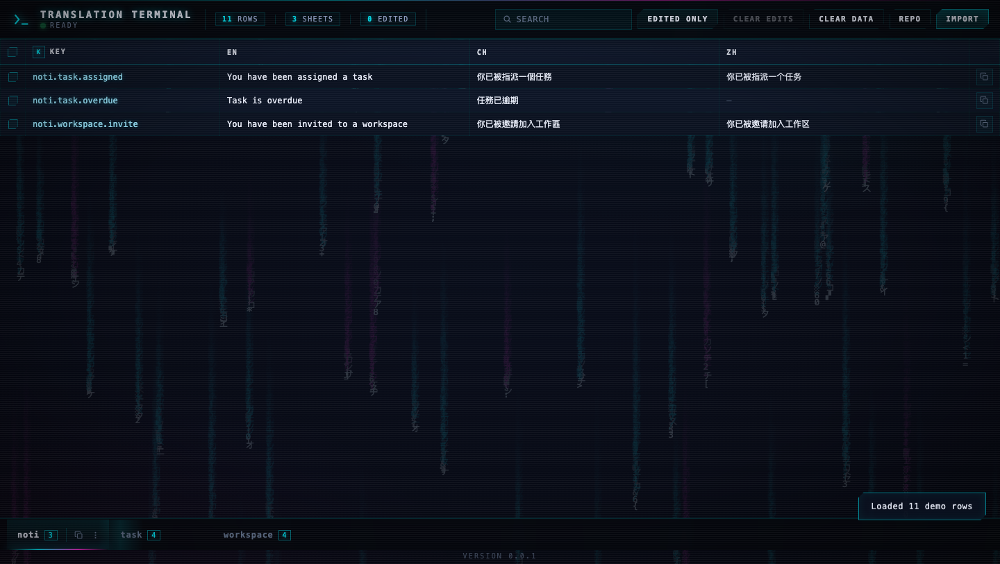
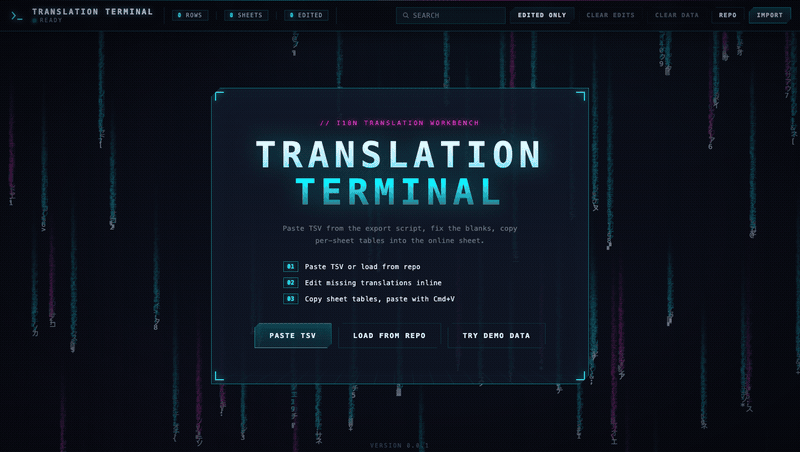
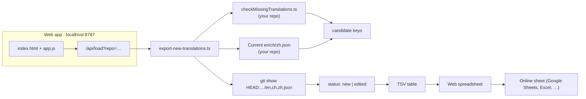

<div align="center">

# ⌨️ TRANSLATION TERMINAL

**A zero-dependency i18n translation workbench for teams shipping en / 繁中 / 简体中文**

Diff your translation bundles against `git HEAD`, spot every new or edited key,
and fix missing strings in a retro-CRT spreadsheet editor — then copy per-sheet
tables straight into your online sheet.

</div>

<div align="center">

[](./LICENSE)
[](https://github.com/jona1167/TRANSLATION-TERMINAL)
[](https://bun.sh)
[](https://www.typescriptlang.org)
[](./package.json)

**CLI** · **Web app** · **Zero dependencies** · **Fully offline** · **Read-only on your repo**

</div>

<p align="center">
  
  <br>
  <sub>The workbench with demo data loaded — sheets grouped by key prefix, blank zh cells ready to fill.</sub>
</p>

<p align="center">
  
  <br>
  <sub>60-second workflow in 4 seconds: load → edit blank cells → search → filter edited → copy.</sub>
</p>

---

## What is this?

For developers who translate i18n bundles through **external spreadsheets** (Google Sheets, Excel, Notion),
Translation Terminal is the missing bridge between your codebase and that spreadsheet.

Every release cycle the same workflow repeats: your app gains new strings, some existing strings get
edited, and someone has to manually figure out *which* keys changed before pasting them into the online
sheet for translators. Translation Terminal automates exactly that step:

- the **CLI** (`export-new-translations.ts`) runs your repo's existing translation checker, compares the
  current `en` / `ch` / `zh` bundles against Git `HEAD`, and emits a clean TSV of **new** and **edited** keys;
- the **web app** turns that TSV into a keyboard-first spreadsheet where you fix the blanks, group rows into
  per-prefix sheets (`task.*` → tab `task`), and copy each sheet as a ready-to-paste table.

It reads your repository, **never** writes to it — no staging, no committing, no pushing.

## ✨ Features

| Feature | Description |
|---------|-------------|
| 🔍 **Git-aware diffing** | Compares current `en/ch/zh.json` against Git `HEAD` — only truly new or edited keys come out |
| ⚡ **Zero dependencies** | Pure Bun + TypeScript + vanilla JS. No npm install, no framework, no build step |
| 🖥️ **Terminal CLI** | One command prints a TSV table; `--clipboard` pipes it straight into your paste buffer |
| 📊 **Sheet auto-grouping** | Rows are bucketed into tabs by key prefix (`workspace.*`, `task.*`, `noti.*`, …) |
| ✏️ **Inline editing** | Click a cell, type, done — edits persist in `localStorage` across reloads |
| 🔎 **Search + filters** | Instant full-table search (`/` or `⌘/Ctrl+F`), plus an "EDITED ONLY" toggle |
| 📋 **Copy-ready TSV** | Per row, per selection, or per whole sheet — paste directly into the online sheet with `Cmd+V` |
| 🗂️ **Import anything** | Paste TSV, import a `.tsv` file, or load straight from your repo path |
| 🔒 **Read-only by design** | The tool only reads the target repository. Your codebase is never modified |
| 🛡️ **Path-traversal guarded** | The local server validates every static path and repo-path input |
| 🎨 **CRT hacker aesthetic** | Scanlines, vignette, Matrix-style rain backdrop — a terminal you'll actually enjoy |

## 🚀 Quick start

**Prerequisite:** [Bun](https://bun.sh) ≥ 1.0 on your machine.

```sh
git clone git@github.com:jona1167/TRANSLATION-TERMINAL.git
cd TRANSLATION-TERMINAL
```

### Option A — CLI (headless)

```sh
bun export-new-translations.ts /path/to/your-app
```

Copy the result to your macOS clipboard instead:

```sh
bun export-new-translations.ts /path/to/your-app --clipboard
```

The target argument may be the **repository root** or its **`apps/frontend`** directory.
The tool auto-detects either. Output is one line per key:

```tsv
key	en	ch	zh
task.create.title	Create task	建立任務	创建任务
noti.task.overdue	Task is overdue	任務已逾期
```

Blank cells are the strings your translators still need — paste the table into the
online sheet and let them fill the gaps.

### Option B — Web app (recommended)

```sh
bun server.ts
# Translation Terminal -> http://localhost:8787
```

Open <http://localhost:8787>, then:

1. **Load** — click `REPO`, enter your repo path (or `BROWSE…` for a native macOS Finder dialog), and hit `LOAD FROM REPO`. You can also paste TSV directly or import a `.tsv` file. Stuck? Click `TRY DEMO DATA`.
2. **Edit** — fix the blank `zh`/`ch` cells inline. Each sheet tab groups a key prefix.
3. **Copy** — select rows (or use `COPY ROW(S) AS TABLE`) or `COPY SHEET`, then paste into the online sheet with `Cmd+V`.

Everything runs locally and offline. Your data lives in `localStorage` — `CLEAR EDITS` undoes your changes, `CLEAR DATA` wipes everything.

## 🧠 How it works



**The pipeline:**

1. **Collect** — your repo's existing `checkMissingTranslations.ts` runs via Bun to find incomplete/missing keys.
2. **Compare** — the current `src/assets/i18n/{en,ch,zh}.json` bundles are flattened and diffed against the same files at `git HEAD`.
3. **Classify** — a key is `new` when it doesn't exist in any locale at `HEAD`; `edited` when any locale value changed since `HEAD`.
4. **Export** — results are sorted, deduped, and rendered as a `key / en / ch / zh` TSV table.
5. **Review** — the web app groups rows into sheets by prefix, tracks your inline edits, and produces copy-ready tables.

## 📦 Project structure

```
translation-terminal/
├── export-new-translations.ts  # CLI — diffs bundles against git HEAD → TSV
├── server.ts                   # Zero-dependency Bun server (static + /api/*)
├── index.html                  # Web UI markup — no framework, no build step
├── app.js                      # Vanilla JS spreadsheet engine (localStorage, sheets, search)
├── styles.css                  # CRT / hacker-terminal theme
├── favicon.svg
├── package.json
└── docs/
    └── screenshot.png          # README hero shot
```

## ⚙️ CLI reference

| Argument | Description |
|----------|-------------|
| `<target>` | Repository root **or** `apps/frontend` directory (defaults to current directory) |
| `--clipboard` | Copy the TSV to the clipboard (`pbcopy` on macOS) instead of printing |
| `--help`, `-h` | Show usage |

**Environment:** the tool requires Bun and the target repo to contain
`checkMissingTranslations.ts` and `src/assets/i18n/{en,ch,zh}.json`.

**API endpoints** (from `server.ts`):

| Endpoint | Purpose |
|----------|---------|
| `GET /api/load?repo=<path>` | Runs the CLI on a repo path, returns `{ ok, rows, summary }` |
| `GET /api/pick-folder` | Opens a native macOS Finder folder dialog (macOS only) |

## 🛠️ For your project

Works out of the box if your app has:

- `src/assets/i18n/en.json`, `ch.json`, `zh.json` — nested objects or flat keys (`task.create.title`)
- a `checkMissingTranslations.ts` script runnable with `bun run`
- Git history (needed for the `HEAD` comparison)

Locales are fixed to **en** (English), **ch** (Traditional Chinese), **zh** (Simplified Chinese) — adjust the `LOCALES` constant at the top of `export-new-translations.ts` to support more.

## ❓ FAQ / Troubleshooting

| Problem | Fix |
|---------|-----|
| `Cannot find checkMissingTranslations.ts` | Pass the **repository root** or **`apps/frontend`**, not a deeper folder |
| Finder picker does nothing | Enable it in **System Settings → Privacy & Security → Automation** |
| `Clipboard unavailable` | Only macOS `pbcopy` is wired up — the table is printed instead |
| My edits vanished | They're in `localStorage` for this browser; `CLEAR EDITS` intentionally wipes them |
| Port 8787 is busy | `PORT=9000 bun server.ts` |

## 🤝 Contributing

Issues and PRs are welcome. Small project, simple rules:

1. Fork → branch → open a PR
2. Keep it zero-dependency — that's the point
3. Match the existing style (CRT theme, vanilla JS, TypeScript with `bun`)

No test suite yet — if you add one, make it run with a single `bun test`.

## 📄 License

[MIT](./LICENSE) © 2026 [Jonathan](https://github.com/jona1167)
